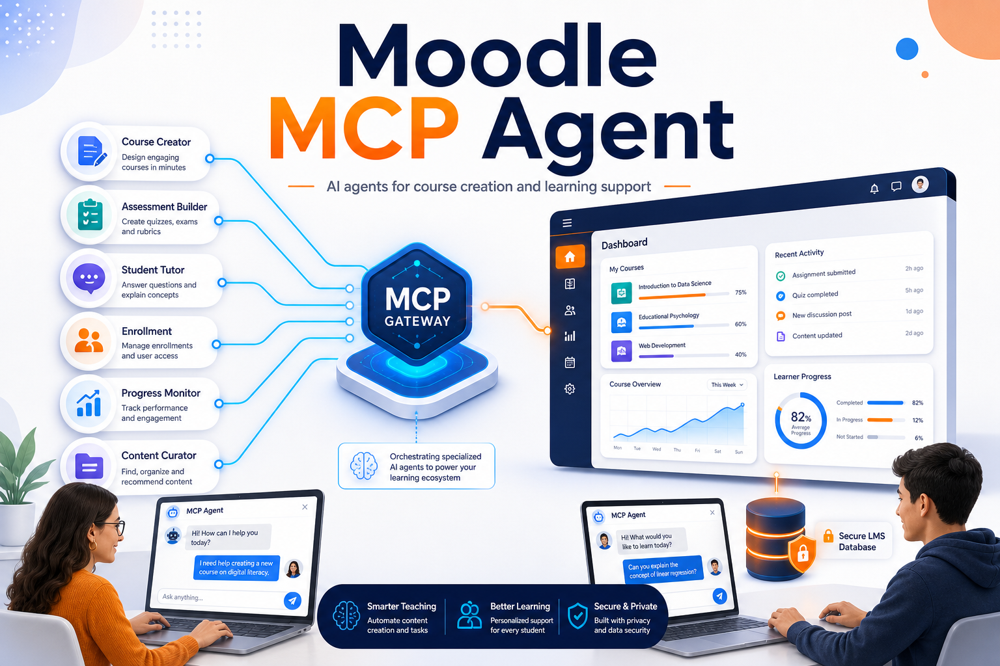
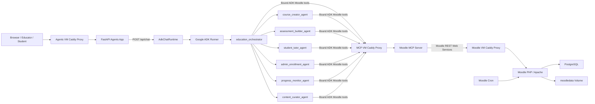
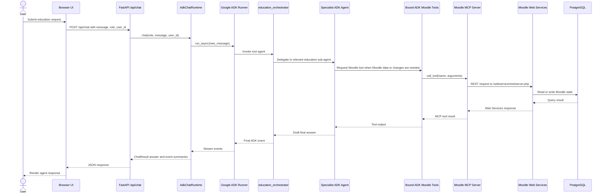

# Moodle MCP Agent



This project installs Moodle and runs separate MCP and ADK/API agent services that work with Moodle through Moodle Web Services.

The first version supports two Moodle-backed user flows:

- Creator: create courses and add basic URL resources.
- Student: list and consume enrolled Moodle courses.

## Architecture

- Moodle, PostgreSQL, and Moodle cron can run on their own VM from `services/moodle/docker-compose.yml`.
- The MCP tools can run on a separate VM from `services/mcp/docker-compose.yml`.
- The ADK/API agents and chat UI can run on a separate VM from `services/agents/docker-compose.yml`.
- The root `docker-compose.yml` remains a local all-in-one developer stack with the same service boundaries.
- The FastAPI app serves a simple web chat UI and calls an OpenAI-compatible LLM endpoint.
- Google ADK agent construction uses LiteLLM settings from Compose, so `LITELLM_PROVIDER=openai` and `LITELLM_MODEL=gpt-4o-mini` become `openai/gpt-4o-mini`.
- Google ADK also exposes an education orchestrator with specialist sub-agents and reusable education skills.
- Set `AGENT_RUNTIME=adk` to make `/api/chat` call the ADK education orchestrator; set `AGENT_RUNTIME=legacy` to use the original OpenAI-compatible tool loop. Both runtimes call Moodle only through MCP.
- Moodle operations are implemented as narrow Python tool functions and exposed through the MCP server.
- Moodle users and configured creator IDs determine effective app roles; production should keep `ALLOW_USER_ID_OVERRIDE=false`.

### System Diagram



### Sequence Diagram: ADK Chat Request



## Local Setup

1. Copy the environment template.

   ```bash
   cp .env.example .env
   ```

2. Edit `.env` and set the Moodle admin password, database password, app secret, LLM key, and hostnames. `MOODLE_DOWNLOAD_URL` controls which Moodle release tarball is baked into the local Moodle image.

3. Start the local all-in-one stack.

   ```bash
   docker compose up -d --build
   ```

4. Open Moodle and finish the initial setup.

   ```text
   http://moodle.localhost
   ```

   After you are logged in, use `http://moodle.localhost` or `http://moodle.localhost/my/`.
   If you manually open `http://moodle.localhost/login/index.php` while already logged in,
   Moodle shows a confirmation page asking whether to log out before logging in as another user.
   Use the explicit `http://` URL for local development so it matches Moodle's configured
   `wwwroot` and avoids proxy scheme redirects.

5. Follow the Moodle Web Services setup guide in `deploy/moodle/SETUP.md`.

6. Add the generated Moodle token to `.env` as `MOODLE_TOKEN`, then restart the MCP and agents services.

   ```bash
   docker compose up -d mcp agents
   ```

7. Open the chat app.

   ```text
   http://app.localhost
   ```

For a pure localhost route without custom hostnames, open `http://localhost`.

## Python Development

Use Python 3.12 or newer.

```bash
python -m venv .venv
source .venv/bin/activate
pip install -e ".[dev,adk]"
pytest
```

Run the API locally:

```bash
uvicorn moodle_mcp.api:app --reload
```

Run the MCP server directly:

```bash
moodle-mcp-server --transport stdio
```

Run a network MCP server locally:

```bash
moodle-mcp-server --transport streamable-http --host 0.0.0.0 --port 8000
```

## Google ADK Education Skills

`build_google_adk_agent()` returns an education orchestrator backed by LiteLLM. When `AGENT_RUNTIME=adk`, the FastAPI `/api/chat` endpoint runs that orchestrator through a Google ADK `Runner`. The orchestrator delegates to specialist ADK sub-agents and connects to Moodle through bound ADK tools that call the MCP server at `MCP_SERVER_URL`. These tools inject the server-resolved Moodle role and user id into every MCP call.

Call chain:

```text
Browser UI -> /api/chat -> AdkChatRuntime -> education_orchestrator -> specialist sub-agent -> Moodle MCP server -> Moodle Web Services
```

Specialist ADK agents:

- `course_creator_agent`: plans and creates course shells, lessons, and starter resources.
- `assessment_builder_agent`: drafts quizzes, rubrics, assignments, and assessment plans.
- `student_tutor_agent`: helps learners understand visible Moodle course content.
- `admin_enrollment_agent`: guides enrollment, access, role, and cohort workflows.
- `progress_monitor_agent`: reviews engagement signals and recommends support interventions.
- `content_curator_agent`: recommends and places learning resources.

Education skills:

- `course-creation-skill`: category discovery, course shell creation, section planning, URL resources.
- `lesson-planning-skill`: objectives, lesson outlines, activities, and Moodle-ready plans.
- `assessment-builder-skill`: quiz, question bank, rubric, and assignment drafts.
- `student-tutor-skill`: learner explanations, course summaries, and next study steps.
- `admin-enrollment-skill`: user access, enrollment, role, and cohort guidance.
- `progress-engagement-skill`: engagement review and at-risk learner support planning.
- `content-curator-skill`: resource recommendations and URL resource creation.
- `support-assistant-skill`: Moodle navigation, access troubleshooting, and setup support.

The current implemented Moodle tool surface supports course shells, URL resources, page resources, categories, user lookup, enrolled-course listing, course contents, and read-only activity completion status. Skills that need quizzes, assignments, grades, files, enrollment writes, cohorts, or reports are scaffolded with explicit future tool requirements.

## Required Moodle Web Services

The app expects Moodle REST Web Services to be enabled with these functions:

- `core_webservice_get_site_info`
- `core_course_get_categories`
- `core_course_create_courses`
- `core_course_get_contents`
- `core_completion_get_activities_completion_status`
- `core_enrol_get_users_courses`
- `core_user_get_users_by_field`
- `mod_page_add_instance`
- `mod_url_add_instance`

The exact Moodle role capabilities still need to be configured inside Moodle. Creator users should only receive the course/category permissions they actually need.

## Deployment On Separate VMs

Use one checkout of this repo per VM, then run the compose file for that VM:

1. Moodle VM: create `services/moodle/.env` from `services/moodle/.env.example`, then run `docker compose -f services/moodle/docker-compose.yml up -d --build`.
2. Complete Moodle setup and create the Web Services token from `deploy/moodle/SETUP.md`.
3. MCP VM: create `services/mcp/.env` from `services/mcp/.env.example`, set `MOODLE_BASE_URL` to the Moodle VM URL and `MOODLE_TOKEN` to the Web Services token, then run `docker compose -f services/mcp/docker-compose.yml up -d --build`.
4. Agents VM: create `services/agents/.env` from `services/agents/.env.example`, set `MCP_SERVER_URL` to the MCP VM endpoint, set `LITELLM_API_KEY`, `LITELLM_PROVIDER`, `LITELLM_MODEL`, and `LITELLM_BASE_URL`, then run `docker compose -f services/agents/docker-compose.yml up -d --build`.
5. Configure backups for PostgreSQL and Moodle data volumes on the Moodle VM.

Only ports 80 and 443 should be exposed publicly on each VM. Database, Moodle container ports, agents ports, and raw MCP ports should remain on the Docker network or private VM network.

See [docs/production-readiness.md](docs/production-readiness.md) for the production identity, authorization, and runtime checklist.

## Current MVP Limits

- Course creation, URL resources, page resources, user lookup, and completion reads are implemented first.
- File upload and richer Moodle activity creation are intentionally left behind capability checks because Moodle Web Services support varies by installation.
- The app resolves effective role server-side from `MOODLE_CREATOR_USER_IDS`; production should keep `ALLOW_USER_ID_OVERRIDE=false` and replace this with Moodle capability checks when per-user auth is added.
