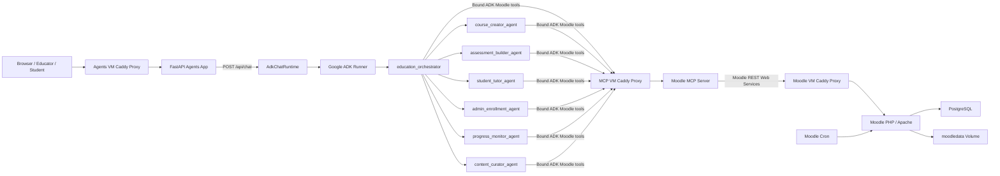
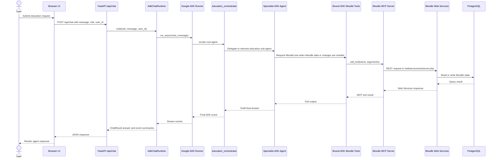
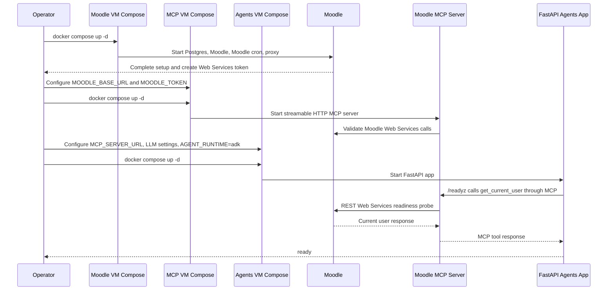

# Architecture Diagrams

These diagrams describe the split Moodle, MCP, and ADK agents deployment.

## System Diagram

## Sequence Diagram: ADK Chat Request

## Sequence Diagram: Service Startup And Readiness

